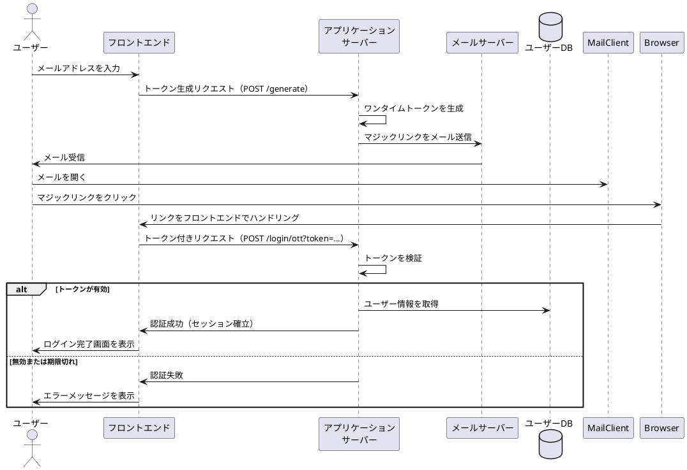

## はじめに

マジックリンク認証は、パスワードを使わない認証方式の一種です。ユーザーがメールアドレスを入力すると、そのアドレス宛にワンタイムトークンを含むリンク（マジックリンク）が送信されます。ユーザーはそのリンクをクリックするだけで認証が完了します。

この方式は、パスワードの記憶が不要であることに加え、フィッシングへの耐性があるという点でも優れています。この記事では、Spring Security 6 の `oneTimeTokenLogin` を活用した、マジックリンク認証の基本的な構成を解説します。

※ 今回の実装は **フロントエンドが別に存在する前提** で構成しており、各エンドポイントは RESTful API のように振る舞う設計になっています。

## アーキテクチャの概要

以下のコンポーネントを用いて、認証フローを構成しています：

- `SecurityConfig`: Spring Security の設定を行います
- `MagicLinkOneTimeTokenGenerationSuccessHandler`: トークン生成後にマジックリンクを生成してメール送信します
- `MagicLinkLoginSuccessController`: 認証成功後にフォワードされたリクエストを処理します
- `UserController`: 認証済みユーザーの情報を取得する確認用エンドポイントです（本認証処理の本筋とは関係ありません）

## 認証フロー図
マジックリンクの全体像がわかるように最初に図を示します。


## SecurityConfig

本実装では、Spring Security 6 に組み込まれている `OneTimeTokenAuthenticationProvider` を利用していますが、その内部に注入する `OneTimeTokenService` と `UserDetailsService` は独自に用意したクラスを使用しています。

`OneTimeTokenService` については、Spring Security によって InMemory や JDBC 実装が標準で提供されていますが、たとえば Redis を用いて実装したい場合には、自前で実装したクラスを使うことになります。本記事でもそのような拡張可能性を示すために、明示的に 
`@Bean` で定義しています。

また `MagikLinkUserDetailsService` も、実際のアプリケーションでは自社のデータベースからメールアドレスをキーにしてユーザー情報を取得する実装が必要になると考えられるため、拡張ポイントとしての意味合いを込めて自作のクラスを使用しています。


以下は、Spring Security の設定クラスです。`oneTimeTokenLogin` を使用して、マジックリンク認証のフローを追加しています。

```kotlin
@Configuration
@EnableWebSecurity
class SecurityConfig {

    @Bean
    fun filterChain(http: HttpSecurity): SecurityFilterChain {
        http
            .oneTimeTokenLogin {
                it
                    .authenticationProvider(oneTimeTokenAuthenticationProvider())
                    .authenticationSuccessHandler(
                        ForwardAuthenticationSuccessHandler("/ott/sent")
                    )
                    .authenticationFailureHandler { _, response, _ ->
                        response.status = HttpServletResponse.SC_UNAUTHORIZED
                    }
            }
            .formLogin { it.disable() }
            .httpBasic { it.disable() }
            .csrf { it.disable() }
        return http.build()
    }

    @Bean
    fun oneTimeTokenAuthenticationProvider(): OneTimeTokenAuthenticationProvider {
        return OneTimeTokenAuthenticationProvider(
            inMemoryOneTimeTokenService(),
            MagikLinkUserDetailsService()
        )
    }

    @Bean
    fun inMemoryOneTimeTokenService(): OneTimeTokenService = InMemoryOneTimeTokenService()
}
```

この構成では、フォームログインや HTTP Basic 認証を無効化し、認証成功時には `/ott/sent` にフォワードするよう設定しています。FilterChain を中断せず後続処理を進められるため、副作用を抑えつつ柔軟な処理が可能になります。

CSRF は今回は無効化していますが、実運用では有効化すべきです。

## MagicLinkOneTimeTokenGenerationSuccessHandler

このクラスは、トークンの生成に成功した際にマジックリンクを構築し、ユーザー宛にメール送信する役割を持ちます。

```kotlin
@Component
class MagicLinkOneTimeTokenGenerationSuccessHandler(
    private val mailSender: MailSender,
) : OneTimeTokenGenerationSuccessHandler {

    override fun handle(request: HttpServletRequest, response: HttpServletResponse, oneTimeToken: OneTimeToken) {
        val builder = UriComponentsBuilder.fromUriString(UrlUtils.buildFullRequestUrl(request))
            .replacePath(request.contextPath)
            .replaceQuery(null)
            .fragment(null)
            .path("/login/ott")
            .queryParam("token", oneTimeToken.getTokenValue())
        val magicLink = builder.toUriString()
        val email = getUserEmail(oneTimeToken.getUsername())
        this.mailSender.send(
            SimpleMailMessage().apply {
                setTo(email)
                text = """Your Spring Security One Time Token", "Use the following link to sign in into the application: $magicLink"""
            }
        )
        response.status = HttpServletResponse.SC_CREATED
        response.contentType = "application/json"
        response.writer.write(
            """{"status":"ok","message":"A magic link has been sent to your email address. Please check your inbox."}"""
        )
    }

    private fun getUserEmail(username: String): String {
        return username
    }
}
```

URI を組み立てる際には `UriComponentsBuilder` を使って `token` をクエリパラメータとして付加し、メールで送信しています。今回は、`username` がそのままメールアドレスである前提で `getUserEmail` を実装しています。

## MagicLinkLoginSuccessController

このクラスは、認証成功時に `/ott/sent` にフォワードされたリクエストを受け取ります。

```kotlin
@RestController
class MagicLinkLoginSuccessController {

    @PostMapping("/ott/sent")
    fun ottSent(): String {
        return "logged in!"
    }
}
```

このようにフォワード先をコントローラーで処理することで、FilterChain の流れを止めずに、自然な形で認証後のレスポンスを返すことができます。

## UserController

以下のコントローラーは、マジックリンク認証とは直接関係ありませんが、**認証が成功してセッションに情報が入っているかを確認するための補助的なエンドポイント**です。

```kotlin
@RestController
@RequestMapping("/api")
class UserController {

    @GetMapping("/username")
    fun getUsername(@AuthenticationPrincipal userDetails: UserDetails): Map<String, String> {
        return mapOf("username" to userDetails.username)
    }
}
```

`@AuthenticationPrincipal` によりログイン済みのユーザー情報が取得できることを確認できます。

## セキュリティ上の注意点

マジックリンク認証は便利で安全性も高いですが、以下の点には注意が必要です：

- トークンは短時間で失効させる
- トークンは十分に長く、予測困難なランダム値とする
- メールにトークン以外の機密情報を含めない
- 本番環境では CSRF 保護を有効にする

## 認証成功後にフォワードを使う理由

`ForwardAuthenticationSuccessHandler` を使うことで、認証成功後の処理を FilterChain の一部として自然に継続できます。flushでレスポンスを返してしまえば、Controllerを用意しなくても済むのですがFilterChainを中断させても問題が生じないか調べきれなかったのでこうしています。

## おわりに

Spring Security 6 の `oneTimeTokenLogin` を使えば、マジックリンク認証を比較的簡単に実装できます。今回紹介した構成では、必要最低限のクラス構成でシンプルに組み立てていますが、本番運用に際してはセキュリティや可用性の観点からさらなる設計の洗練が必要になるかもしれません。

今回の実装が、パスワードレス認証の導入を検討する上での参考になれば幸いです。

